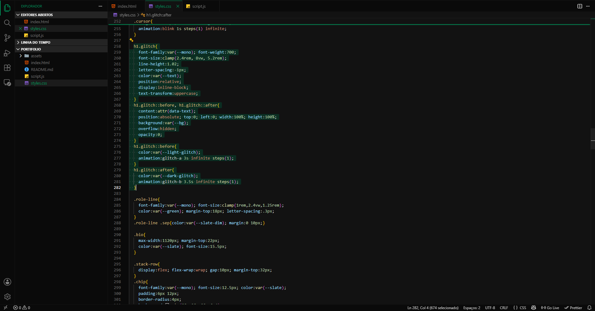

<h1>OZURAC</h1>

<em>Tema escuro com detalhes em verde</em>

  &nbsp; 
 &nbsp; 
</a>

---

## 🎨 Sobre

**OZURAC** é um tema escuro para Visual Studio Code, projetado com foco em contraste equilibrado, legibilidade e conforto visual.

Utiliza tons de verde como cor de destaque, mantendo uma interface limpa e consistente para longas sessões de desenvolvimento.

---

## ✨ Características

- 🌑 Tema escuro com acentos em **verde escuro**
- 💬 Comentários em **cinza escuro**
- 👁️ Contraste otimizado para melhor legibilidade
- 🧩 Interface minimalista e consistente

---

## 📦 Instalação

**Pela Marketplace do VS Code** *(se publicado)*:
1. Abra a aba de Extensões (`Ctrl+Shift+X`)
2. Busque por `Ozurac`
3. Clique em **Install**

**Manualmente (via `.vsix`)**:
1. Baixe o pacote `.vsix` mais recente das [Releases](https://github.com/gfialhob/Ozurac/releases)
2. Na aba de Extensões, clique em `...` → **Install from VSIX...**
3. Selecione o arquivo baixado

**Ativando o tema:**
`Ctrl+Shift+P` → `Preferences: Color Theme` → **Ozurac**

---

## 🤝 Contribuindo

Sugestões, ajustes de contraste ou correções são bem-vindos! Abra uma [issue](https://github.com/gfialhob/Ozurac/issues) ou envie um pull request.

---

## 📄 Licença

Distribuído sob a licença **MIT**. Consulte o arquivo `LICENSE` para mais informações.

---

<h4 align="center">Feito para desenvolvedores que preferem foco e contraste. 🚀</h4>
